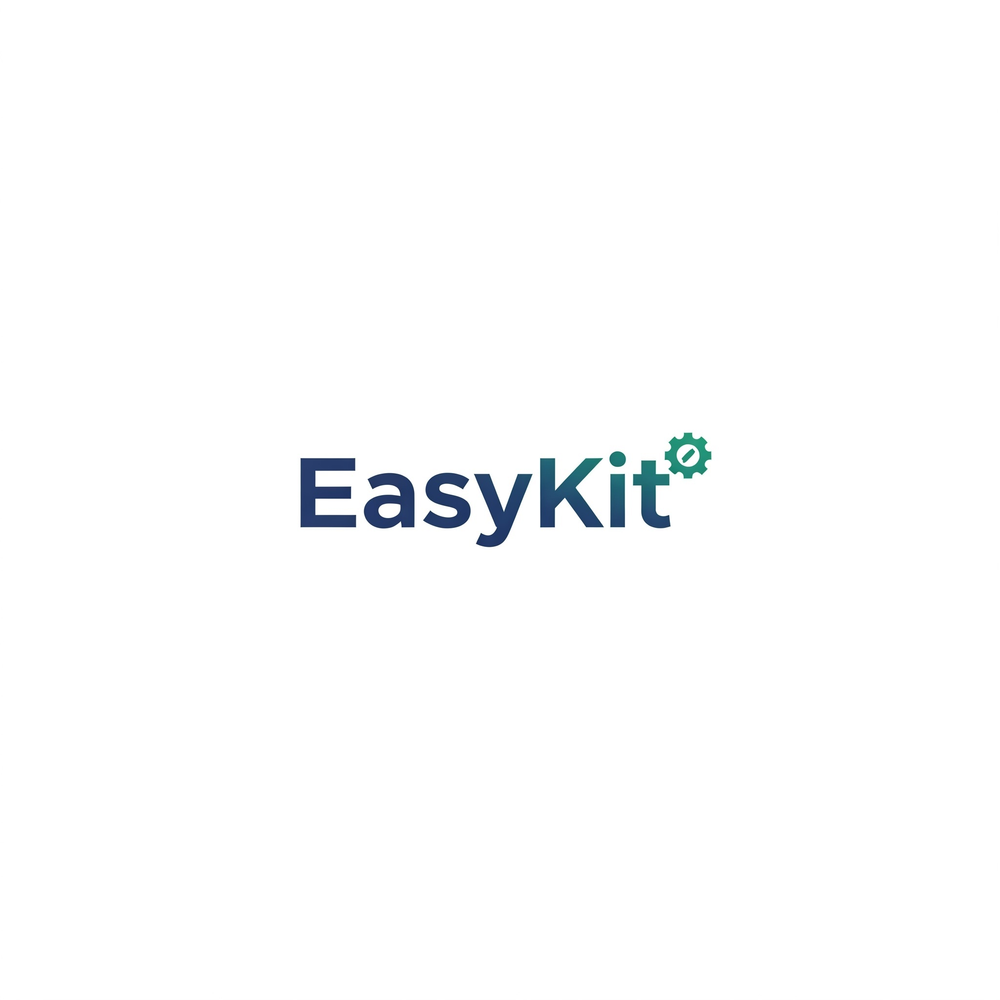

<!-- Improved compatibility of back to top link: See: https://github.com/othneildrew/Best-README-Template/pull/73 -->

<a id="readme-top"></a>

<!-- PROJECT SHIELDS -->

[![Contributors][contributors-shield]][contributors-url]
[![Forks][forks-shield]][forks-url]
[![Stargazers][stars-shield]][stars-url]
[![Issues][issues-shield]][issues-url]
[![MIT License][license-shield]][license-url]

<!-- PROJECT LOGO -->
<br />
<div align="center">
  
  <h3 align="center">EasyKit</h3>
  <p align="center">
    Automate tasks, simplify Windows maintenance, and eliminate repetitive processes with this .NET-powered toolkit for web developers.
    <br />
    <a href="https://github.com/LoveDoLove/EasyKit"><strong>Explore the docs »</strong></a>
    <br />
    <br />
    <a href="https://github.com/LoveDoLove/EasyKit">View Demo</a>
    &middot;
    <a href="https://github.com/LoveDoLove/EasyKit/issues/new?labels=bug&template=bug-report---.md">Report Bug</a>
    &middot;
    <a href="https://github.com/LoveDoLove/EasyKit/issues/new?labels=enhancement&template=feature-request---.md">Request Feature</a>
  </p>
</div>

<details>
  <summary>Table of Contents</summary>
  <ol>
    <li><a href="#about-the-project">About The Project</a>
      <ul>
        <li><a href="#features">Features</a></li>
        <li><a href="#built-with">Built With</a></li>
      </ul>
    </li>
    <li><a href="#getting-started">Getting Started</a>
      <ul>
        <li><a href="#prerequisites">Prerequisites</a></li>
        <li><a href="#installation">Installation</a></li>
      </ul>
    </li>
    <li><a href="#usage">Usage</a></li>
    <li><a href="#roadmap">Roadmap</a></li>
    <li><a href="#contributing">Contributing</a></li>
    <li><a href="#license">License</a></li>
    <li><a href="#contact">Contact</a></li>
    <li><a href="#acknowledgments">Acknowledgments</a></li>
  </ol>
</details>

<!-- ABOUT THE PROJECT -->

## About The Project

EasyKit is a modular, menu-driven Windows toolkit for web developers. It streamlines common development and maintenance tasks by providing a unified console UI for Git, NPM, Composer, Laravel, and more. With built-in tool detection, context menu integration, and a marketplace for essential developer tools, EasyKit helps automate workflows and reduce repetitive work.

### Features

- Unified console UI for:
  - Git tools (clone, commit, push, pull, branch, etc.)
  - NPM tools (install, update, audit, etc.)
  - Composer tools (install, update, dump-autoload, etc.)
  - Laravel tools (artisan commands, migrations, etc.)
  - Tool Marketplace (detect/install Node.js, npm, PHP, Composer, Git)
  - Settings management
- Context menu support for quick access from Windows Explorer
- Colorized console output and notifications
- Modular, extensible architecture
- Requires administrator rights for some features
- .NET 8.0+ support

<p align="right">(<a href="#readme-top">back to top</a>)</p>

### Built With

- [.NET 8.0](https://dotnet.microsoft.com/en-us/download/dotnet/8.0)
- [CommonUtilities](https://github.com/LoveDoLove/CS_CommonUtilities)

<p align="right">(<a href="#readme-top">back to top</a>)</p>

<!-- GETTING STARTED -->

## Getting Started

To get a local copy up and running:

### Prerequisites

- Windows 10/11
- [.NET 8.0 SDK](https://dotnet.microsoft.com/en-us/download/dotnet/8.0)
- (Optional) Git, Node.js, npm, PHP, Composer, Laravel (for full tool support)

### Installation

1. Clone the repository:
   ```cmd
   git clone https://github.com/LoveDoLove/EasyKit.git
   ```
2. Open `EasyKit.sln` in Visual Studio 2022+ or JetBrains Rider
3. Build the solution (Release or Debug)
4. Run the EasyKit project (admin rights recommended)

<p align="right">(<a href="#readme-top">back to top</a>)</p>

<!-- USAGE EXAMPLES -->

## Usage

- Launch EasyKit from the Start Menu, desktop, or context menu (if registered)
- Use the arrow keys or number keys to navigate the main menu
- Select Git, NPM, Composer, Laravel, or Tool Marketplace for relevant actions
- Use Settings to configure appearance and behavior
- Tool Marketplace helps you detect and install missing developer tools

For more usage details, see the in-app help or source code comments.

<p align="right">(<a href="#readme-top">back to top</a>)</p>

<!-- CONTRIBUTING -->

## Contributing

Contributions are what make the open source community such an amazing place to learn, inspire, and create. Any contributions you make are **greatly appreciated**.

To contribute:

1. Fork the Project
2. Create your Feature Branch (`git checkout -b feature/AmazingFeature`)
3. Commit your Changes (`git commit -m 'Add some AmazingFeature'`)
4. Push to the Branch (`git push origin feature/AmazingFeature`)
5. Open a Pull Request

Please follow the .NET Foundation code of conduct and best practices.

<p align="right">(<a href="#readme-top">back to top</a>)</p>

<!-- LICENSE -->

## License

Distributed under the MIT License. See `LICENSE` for more information.

<p align="right">(<a href="#readme-top">back to top</a>)</p>

<!-- CONTACT -->

## Contact

LoveDoLove - [GitHub](https://github.com/LoveDoLove)

Project Link: [https://github.com/LoveDoLove/EasyKit](https://github.com/LoveDoLove/EasyKit)

<p align="right">(<a href="#readme-top">back to top</a>)</p>

## Sponsorship

This project is proudly supported by [ZMTO](https://www.zmto.com) as part of their open-source VPS program. We extend our sincere gratitude to ZMTO for their valuable resources and commitment to empowering open-source innovation.

<p align="right">(<a href="#readme-top">back to top</a>)</p>

<!-- ACKNOWLEDGMENTS -->

## Acknowledgments

- [Best-README-Template](https://github.com/othneildrew/Best-README-Template)
- [Choose an Open Source License](https://choosealicense.com)
- [.NET Foundation](https://dotnetfoundation.org/)
- [CommonUtilities](https://github.com/LoveDoLove/CS_CommonUtilities)

<p align="right">(<a href="#readme-top">back to top</a>)</p>

<!-- MARKDOWN LINKS & IMAGES -->

[contributors-shield]: https://img.shields.io/github/contributors/LoveDoLove/EasyKit.svg?style=for-the-badge
[contributors-url]: https://github.com/LoveDoLove/EasyKit/graphs/contributors
[forks-shield]: https://img.shields.io/github/forks/LoveDoLove/EasyKit.svg?style=for-the-badge
[forks-url]: https://github.com/LoveDoLove/EasyKit/network/members
[stars-shield]: https://img.shields.io/github/stars/LoveDoLove/EasyKit.svg?style=for-the-badge
[stars-url]: https://github.com/LoveDoLove/EasyKit/stargazers
[issues-shield]: https://img.shields.io/github/issues/LoveDoLove/EasyKit.svg?style=for-the-badge
[issues-url]: https://github.com/LoveDoLove/EasyKit/issues
[license-shield]: https://img.shields.io/github/license/LoveDoLove/EasyKit.svg?style=for-the-badge
[license-url]: https://github.com/LoveDoLove/EasyKit/blob/main/LICENSE
