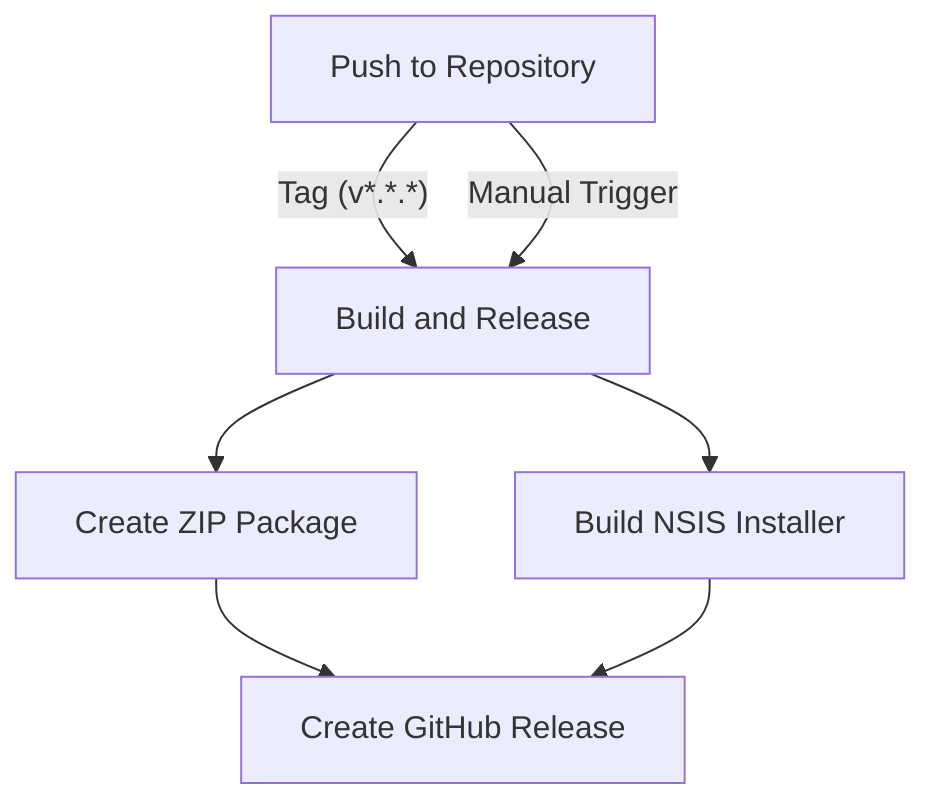

# EasyKit


[](https://opensource.org/licenses/MIT)
[](https://github.com/LoveDoLove/EasyKit/releases)

EasyKit is a powerful collection of batch scripts designed to simplify web development and system maintenance tasks on Windows systems. It provides a convenient menu-driven interface for common development workflows including npm, Laravel, Composer, and Git operations.

## 🚀 Features

- **Centralized Development Interface**: Access all your development tools from a single menu
- **NPM Management**: Install, update, and manage npm packages with ease
- **Laravel Tools**: Quickly set up, configure, and manage Laravel projects
- **Composer Management**: Handle Composer dependencies and operations
- **Git Workflows**: Streamline git operations, including repositories, branches, and PRs
- **System Maintenance**: Perform system maintenance tasks without remembering complex commands
- **Configuration System**: Customize settings to match your workflow
- **Logging**: Track operations with detailed logs for troubleshooting
- **Desktop Integration**: Create desktop and Start Menu shortcuts

## 📋 Menu Structure

- **Main Menu**: Central hub for accessing all features
- **NPM Menu**: NPM package and project management
- **Laravel Menu**: Laravel project setup and management
- **Composer Menu**: Composer dependency management
- **Git Menu**: Git repository operations
- **Settings**: Customize EasyKit behavior and appearance
- **Update Manager**: Keep EasyKit up to date

## 🛠️ Getting Started

### Prerequisites

- Windows OS
- Required development tools:
  - Node.js and npm (for NPM features)
  - PHP and Composer (for Laravel and Composer features)
  - Git (for version control features)

### Installation

1. Clone the repository:
   ```bash
   git clone https://github.com/LoveDoLove/EasyKit.git
   ```
2. Navigate to the repository directory:
   ```bash
   cd EasyKit
   ```
3. Run EasyKit:
   ```bash
   run_eskit.bat
   ```

### Configuration

EasyKit is configured through the `config_eskit.bat` file, where you can modify:

- Color schemes
- Default paths
- Logging settings
- Update behavior
- UI preferences

## 📁 Project Structure

```
EasyKit/
├── run_eskit.bat             # Main entry point
├── config/                   # Configuration files
│   └── config_eskit.bat      # Configuration settings
├── scripts/                  # Script files
│   ├── core/                 # Core functionality
│   │   ├── common_eskit.bat  # Shared functions
│   │   ├── update_eskit.bat  # Update management
│   │   ├── check_software_eskit.bat # Software dependency check
│   │   └── create_shortcuts_eskit.bat # Shortcut creation
│   ├── tools/                # Tool-specific scripts
│   │   ├── npm_eskit.bat     # NPM tools
│   │   ├── laravel_eskit.bat # Laravel tools
│   │   ├── composer_eskit.bat # Composer tools
│   │   └── git_eskit.bat     # Git tools
│   ├── build/                # Build scripts
│   │   ├── build_package.bat # Package builder
│   │   ├── build_nsis_installer.bat # NSIS installer builder
│   │   └── create_release.bat # Release management
│   └── github/               # GitHub integration
│       └── prepare_for_github_actions.bat # GitHub Actions setup
├── installer/                # Installer files
│   └── EasyKit.nsi           # NSIS installer script
├── images/                   # Icon resources
└── logs/                     # Operation logs
```

## 🖥️ Usage Examples

### NPM Package Management

```bash
# From the main menu, select option 1, then option 1 again to install packages
# Or run directly:
npm_eskit.bat
# Then select option 1
```

### Laravel Project Setup

```bash
# From the main menu, select option 2, then option 1 for quick setup
# Or run directly:
laravel_eskit.bat
# Then select option 1
```

### Git Operations

```bash
# From the main menu, select option 4, then navigate the Git menu
# Or run directly:
git_eskit.bat
```

## 📈 Advanced Usage

### Creating Desktop Shortcuts

```bash
# From the main menu, select option 5
# Or run directly:
create_shortcuts_eskit.bat
```

### Customizing Appearance

```bash
# From the main menu, select option 6, then option 4
```

## 🤝 Contributing

Contributions are welcome and appreciated! Here's how you can contribute:

1. Fork the repository
2. Create a feature branch: `git checkout -b feature-name`
3. Commit your changes: `git commit -m 'Add some feature'`
4. Push to the branch: `git push origin feature-name`
5. Open a pull request

### Contribution Guidelines

- Follow existing code style and structure
- Update documentation for any new features or changes
- Add detailed commit messages
- Test your changes thoroughly

## 🔄 CI/CD and Releases

EasyKit uses GitHub Actions to automate building and releasing packages. The automation workflow:

1. Automatically builds packages when a version tag is pushed
2. Creates installer packages for each release
3. Publishes releases with both ZIP and NSIS installer options

### Working with GitHub Actions

- **Release Creation**: Creating a tag (e.g., `v1.2.4`) automatically triggers the build and release process
- **Manual Builds**: You can manually trigger builds from the Actions tab in GitHub

### Workflow Diagram



### Creating a Release

To create a new release:

```bash
git tag v1.2.4
git push origin v1.2.4
```

The GitHub Actions workflow will automatically build and publish the release.

## 📜 License

This project is licensed under the MIT License - see the [LICENSE](LICENSE) file for details.

## 🔄 Version History

- **v1.2.4** - Restructured project for better organization and maintainability
- **v1.2.3** - Fixed issues with shortcut creation and added more logging
- **v1.2.2** - Fixed issues with shortcut creation and added more logging
- **v1.2.1** - Bug fixes and minor improvements
- **v1.2.0** - Added GitHub Actions for automated builds and releases, enhanced update system
- **v1.1.0** - Added configuration system, improved logging, and standardized menus
- **v1.0.0** - Initial release with basic functionality

## 📞 Contact

For any questions, suggestions or feedback:

- Create an issue on GitHub
- Contact the repository owner: [LoveDoLove](https://github.com/LoveDoLove)

## 🙏 Acknowledgements

- All the contributors who have helped improve EasyKit
- The Windows batch scripting community for sharing knowledge and techniques
