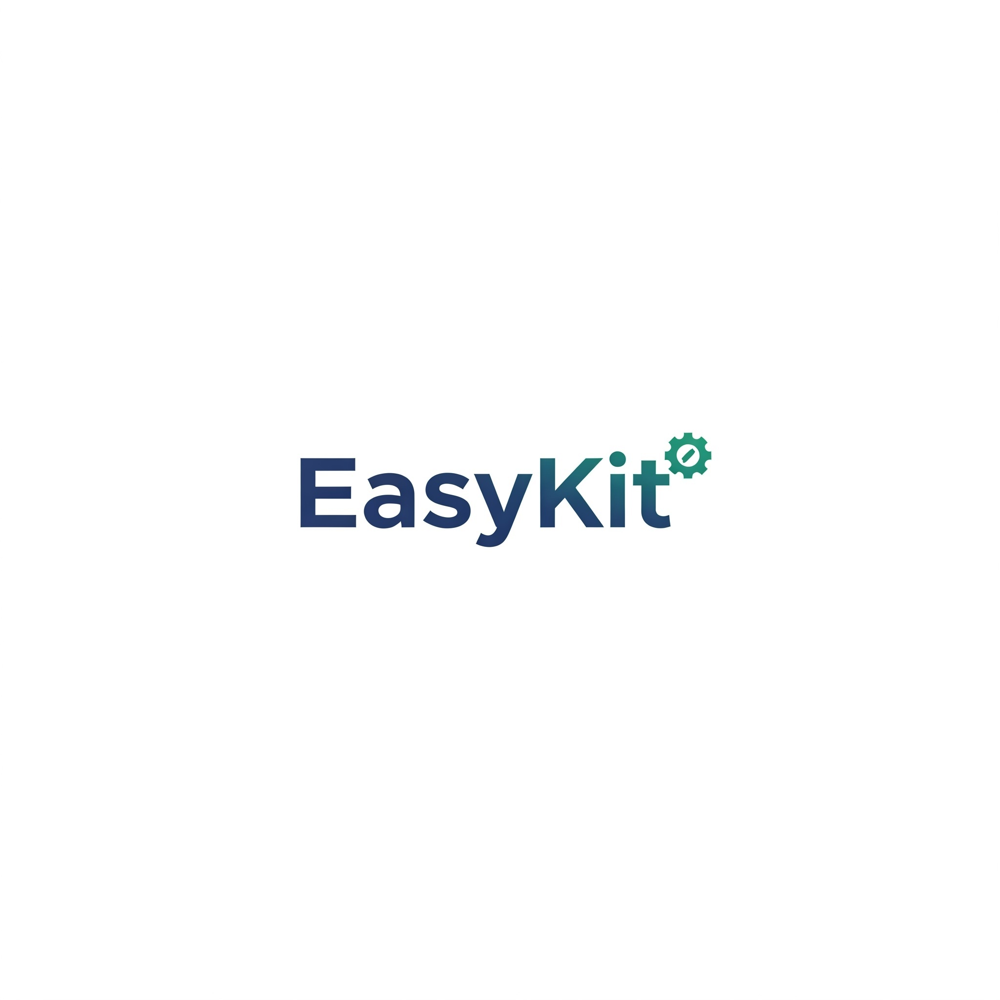

<!-- Improved compatibility of back to top link: See: https://github.com/othneildrew/Best-README-Template/pull/73 -->

<a id="readme-top"></a>

<!-- PROJECT SHIELDS -->

[![Contributors][contributors-shield]][contributors-url]
[![Forks][forks-shield]][forks-url]
[![Stargazers][stars-shield]][stars-url]
[![Issues][issues-shield]][issues-url]
[![MIT License][license-shield]][license-url]

<!-- PROJECT LOGO -->
<br />
<div align="center">
  
  <h3 align="center">EasyKit</h3>
  <p align="center">
    A .NET-powered toolkit for web developers providing a unified console UI for Git, NPM, Composer, and Laravel tools
    <br />
    <a href="https://github.com/LoveDoLove/EasyKit"><strong>Explore the docs »</strong></a>
    <br />
    <br />
    <a href="https://github.com/LoveDoLove/EasyKit/releases">Download Latest</a>
    &middot;
    <a href="https://github.com/LoveDoLove/EasyKit/issues/new?labels=bug&template=bug-report---.md">Report Bug</a>
    &middot;
    <a href="https://github.com/LoveDoLove/EasyKit/issues/new?labels=enhancement&template=feature-request---.md">Request Feature</a>
  </p>
</div>

<details>
  <summary>Table of Contents</summary>
  <ol>
    <li><a href="#about-the-project">About The Project</a>
      <ul>
        <li><a href="#features">Features</a></li>
        <li><a href="#built-with">Built With</a></li>
      </ul>
    </li>
    <li><a href="#getting-started">Getting Started</a>
      <ul>
        <li><a href="#prerequisites">Prerequisites</a></li>
        <li><a href="#installation">Installation</a></li>
      </ul>
    </li>
    <li><a href="#usage">Usage</a></li>
    <li><a href="#roadmap">Roadmap</a></li>
    <li><a href="#contributing">Contributing</a></li>
    <li><a href="#license">License</a></li>
    <li><a href="#contact">Contact</a></li>
    <li><a href="#acknowledgments">Acknowledgments</a></li>
  </ol>
</details>

<!-- ABOUT THE PROJECT -->

## About The Project

EasyKit is a comprehensive Windows toolkit designed specifically for web developers. It provides a unified console interface that integrates multiple development tools including Git, NPM, Composer, and Laravel Artisan, making it easier to manage web development workflows on Windows systems.

Key features include:

- **Unified Interface**: Single console application for all your development tools
- **Git Integration**: Complete Git workflow management with secure command execution
- **NPM Support**: Node.js package management
- **pnpm Support**: First-class pnpm support with workspace/monorepo detection
- **uv Support**: Python package/project/tool management (new!)
- **Composer Integration**: PHP dependency management
- **Laravel Tools**: Artisan command execution
- **Tool Marketplace**: Detect and install missing development tools
- **EasyKit Doctor**: Comprehensive environment diagnostics (new!)
- **Project Detection**: Automatic detection of project types (Git, Node.js, pnpm, Python, uv, PHP, .NET, Docker)
- **Windows Optimized**: Designed specifically for Windows 10/11
- **Modern .NET**: Built with .NET 8.0 for performance and reliability
- **Security**: Secure process execution with shell injection prevention
- **Context Menu Support**: Quick access from Windows Explorer
- **Colorized Output**: Enhanced console experience with notifications

<p align="right">(<a href="#readme-top">back to top</a>)</p>

### Built With

- [![.NET][.NET-badge]][.NET-url] - .NET 8.0 Framework
- [![C#][C#-badge]][C#-url] - Primary programming language
- [![Windows][Windows-badge]][Windows-url] - Target platform
- [CommonUtilities](https://github.com/LoveDoLove/CS_CommonUtilities) - Shared utility library

<p align="right">(<a href="#readme-top">back to top</a>)</p>

<!-- GETTING STARTED -->

## Getting Started

EasyKit is designed to run on Windows systems and provides an easy way to get started with web development tools.

### Prerequisites

Before running EasyKit, ensure you have the following installed:

- **Windows 10 or 11**
- **.NET 8.0 SDK** - Download from [Microsoft .NET](https://dotnet.microsoft.com/download/dotnet/8.0)
- **Optional Development Tools**:
  - Git (for Git operations)
  - Node.js and NPM (for JavaScript/TypeScript projects)
  - PHP and Composer (for PHP/Laravel projects)

### Installation

#### Option 1: Download Pre-built Release (Recommended)

1. Visit the [Releases](https://github.com/LoveDoLove/EasyKit/releases) page
2. Download the latest `EasyKit-x.x.x-x64.exe` or `EasyKit-x.x.x-x86.exe` depending on your system
3. Run the installer and follow the setup wizard

#### Option 2: Build from Source

1. Clone the repository:
   ```cmd
   git clone https://github.com/LoveDoLove/EasyKit.git
   ```
2. Open `EasyKit.sln` in Visual Studio 2022+ or JetBrains Rider
3. Build the solution (Release or Debug)
4. Run the EasyKit project (admin rights recommended)

<p align="right">(<a href="#readme-top">back to top</a>)</p>

<!-- USAGE EXAMPLES -->

## Usage

After installation, simply run EasyKit from your Start menu or by executing the installed application. The console interface will present you with a menu of available tools:

| Key | Feature | Description |
|-----|---------|-------------|
| 1 | Git Tools | Complete Git workflow management |
| 2 | NPM Tools | Node.js package management |
| 3 | pnpm Tools | pnpm package management with workspace support |
| 4 | Composer Tools | PHP dependency management |
| 5 | Laravel Tools | Laravel Artisan command execution |
| 6 | uv Tools | Python package/project/tool management |
| 7 | Settings | Application settings |
| 8 | Diagnostics | EasyKit Doctor - Environment diagnostics |
| T | Tool Marketplace | Detect and manage development tools |
| Q | Quit | Exit application |

### Project Detection

EasyKit automatically detects your project type based on the following files:

- `.git/` → Git repository
- `package.json` → Node.js project
- `pnpm-lock.yaml` / `pnpm-workspace.yaml` → pnpm project
- `pyproject.toml` / `uv.lock` → Python/uv project
- `composer.json` → PHP/Composer project
- `artisan` → Laravel project
- `*.csproj` → .NET project
- `Dockerfile` / `docker-compose*.yml` → Docker project

The current project type is displayed in the main menu.

Navigate through the menu using your keyboard to access the various development tools integrated into EasyKit.

For more usage details, see the in-app help or source code comments.

<p align="right">(<a href="#readme-top">back to top</a>)</p>

## Roadmap

EasyKit has evolved significantly since its inception:

- **v3.x Series**: Pure Python implementation with Windows focus
- **v4.0.6**: Major transition to .NET framework
- **v4.1.x Series**: Enhanced .NET implementation with improved performance
- **Current v4.2.3**: Latest stable release with security fixes, pnpm/uv support, Doctor diagnostics, and project detection

### Recent Additions (v4.2.3)

- ✅ pnpm first-class support with workspace detection
- ✅ uv Python package manager support
- ✅ EasyKit Doctor diagnostic tool
- ✅ Automatic project type detection
- ✅ Secure process execution (shell injection prevention)
- ✅ Comprehensive unit tests

### Future Plans

- [ ] Improve UI/UX with project-aware menus
- [ ] Add more Git features
- [ ] Add Docker support
- [ ] Add integration tests
- [ ] Add CI/CD pipeline

See the [open issues](https://github.com/LoveDoLove/EasyKit/issues) for a full list of proposed features and known issues.

<p align="right">(<a href="#readme-top">back to top</a>)</p>

<!-- CONTRIBUTING -->

## Contributing

Contributions are what make the open source community such an amazing place to learn, inspire, and create. Any contributions you make are **greatly appreciated**.

To contribute:

1. Fork the Project
2. Create your Feature Branch (`git checkout -b feature/AmazingFeature`)
3. Commit your Changes (`git commit -m 'Add some AmazingFeature'`)
4. Push to the Branch (`git push origin feature/AmazingFeature`)
5. Open a Pull Request

Please follow the .NET Foundation code of conduct and best practices.

<p align="right">(<a href="#readme-top">back to top</a>)</p>

<!-- LICENSE -->

## License

Distributed under the MIT License. See `LICENSE` for more information.

<p align="right">(<a href="#readme-top">back to top</a>)</p>

<!-- CONTACT -->

## Contact

LoveDoLove - [GitHub](https://github.com/LoveDoLove)

Project Link: [https://github.com/LoveDoLove/EasyKit](https://github.com/LoveDoLove/EasyKit)

<p align="right">(<a href="#readme-top">back to top</a>)</p>

## Sponsorship

This project is proudly supported by [ZMTO](https://www.zmto.com) as part of their open-source VPS program. We extend our sincere gratitude to ZMTO for their valuable resources and commitment to empowering open-source innovation.

<p align="right">(<a href="#readme-top">back to top</a>)</p>

<!-- ACKNOWLEDGMENTS -->

## Acknowledgments

- [Best-README-Template](https://github.com/othneildrew/Best-README-Template)
- [Choose an Open Source License](https://choosealicense.com)
- [.NET Foundation](https://dotnetfoundation.org/)
- [CommonUtilities](https://github.com/LoveDoLove/CS_CommonUtilities)

<p align="right">(<a href="#readme-top">back to top</a>)</p>

<!-- MARKDOWN LINKS & IMAGES -->

[contributors-shield]: https://img.shields.io/github/contributors/LoveDoLove/EasyKit.svg?style=for-the-badge
[contributors-url]: https://github.com/LoveDoLove/EasyKit/graphs/contributors
[forks-shield]: https://img.shields.io/github/forks/LoveDoLove/EasyKit.svg?style=for-the-badge
[forks-url]: https://github.com/LoveDoLove/EasyKit/network/members
[stars-shield]: https://img.shields.io/github/stars/LoveDoLove/EasyKit.svg?style=for-the-badge
[stars-url]: https://github.com/LoveDoLove/EasyKit/stargazers
[issues-shield]: https://img.shields.io/github/issues/LoveDoLove/EasyKit.svg?style=for-the-badge
[issues-url]: https://github.com/LoveDoLove/EasyKit/issues
[license-shield]: https://img.shields.io/github/license/LoveDoLove/EasyKit.svg?style=for-the-badge
[license-url]: https://github.com/LoveDoLove/EasyKit/blob/main/LICENSE
[.NET-badge]: https://img.shields.io/badge/.NET-512BD4?style=for-the-badge&logo=dotnet&logoColor=white
[.NET-url]: https://dotnet.microsoft.com/
[C#-badge]: https://img.shields.io/badge/C%23-239120?style=for-the-badge&logo=c-sharp&logoColor=white
[C#-url]: https://docs.microsoft.com/en-us/dotnet/csharp/
[Windows-badge]: https://img.shields.io/badge/Windows-0078D4?style=for-the-badge&logo=windows&logoColor=white
[Windows-url]: https://www.microsoft.com/windows
