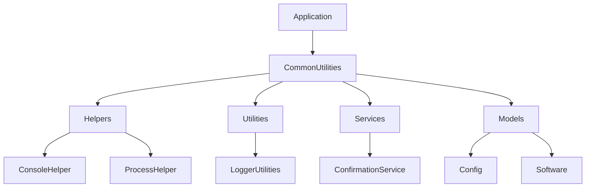
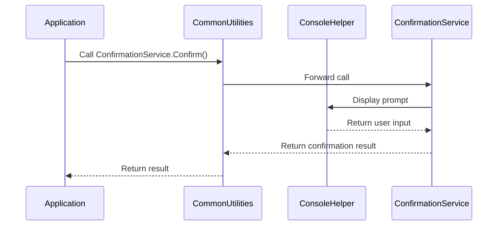
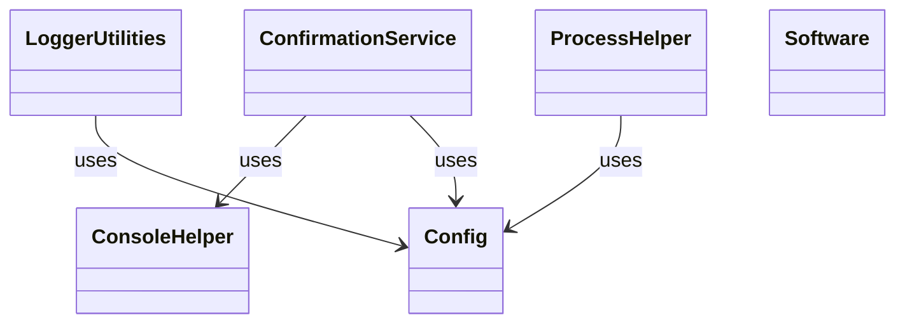

# CommonUtilities Specification

## Purpose
CommonUtilities is a modular, reusable .NET 8 class library providing essential helpers, utilities, services, and models for C# projects. It consolidates generic logic from EasyKit and other sources for global use and maintainability.

## Architecture Overview

- **Helpers:** ConsoleHelper, ProcessHelper
- **Utilities:** LoggerUtilities, ValidationUtilities, etc.
- **Services:** ConfirmationService, Scheduler, etc.
- **Models:** Config, Software, and supporting data models
- **Interfaces:** For extensibility and abstraction

## Module Breakdown

- **ConsoleHelper:** Handles console output, formatting, and user prompts.
- **ProcessHelper:** Manages process execution, diagnostics, and environment checks.
- **LoggerUtilities:** Provides logging methods for diagnostics and auditing.
- **ConfirmationService:** Offers config-aware confirmation prompts.
- **Config/Software Models:** Represent configuration and software metadata.

## UML Diagrams

### Flow Chart (Component Interaction)

### Sequence Diagram (Service Usage)

### Association Diagram (Class Relationships)

## Extensibility

- New helpers, utilities, or services can be added as needed.
- Interfaces allow for custom implementations and testing.

## Packaging

- Target Framework: .NET 8
- Ready for NuGet packaging (not yet published)

## Usage

Reference CommonUtilities in any .NET 8+ C# project to access shared logic and services.